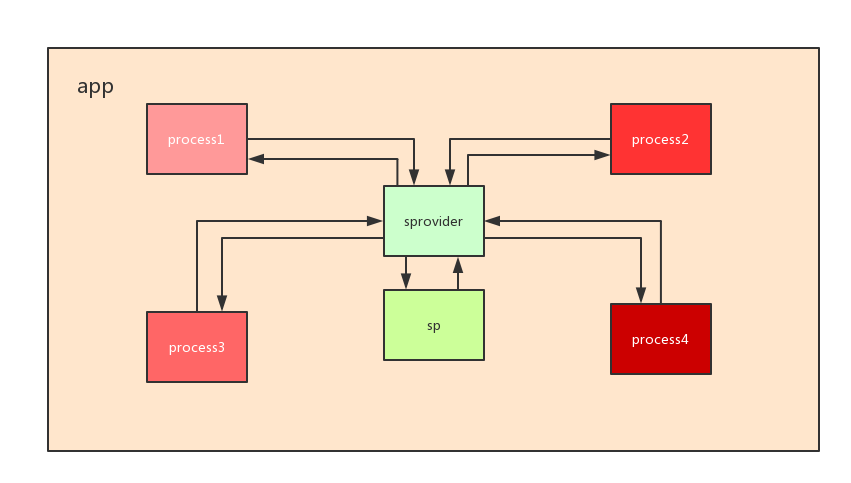

#safeshareperferences

## SharedPreferences真的安全吗?

SharedPreferences是单进程线程安全,Android系统进程之间的内存是隔离的,
这样就导致了进程之间如果访问同一个数据文件,进行数据共享通信的时候,可能会
出现下面几种异常:

1. 数据不一致
2. 数据异常
3. 文件异常

## 进程之间数据共享

要想实现进程中之间安全通信,我们需要将不同进程之间对数据的访问映射到同一个数据
进程,然后通过这个进程实现线程安全实现数据通信,我们可以将这个进程理解为代理进程
,Android系统已经提供给我们ContentProvider进程,我们通过这个就可以实现安全通信

## 进程之间数据共享图例



## Usage
1. 注册provider

	```
  	<provider
                 android:authorities="{packageName}.SharePreferencesProvider"
                 android:name="com.longway.safeshareperferences.SharePreferencesProvider"
                 android:enabled="true"
                 android:exported="true">
   	</provider>
	```
2. 注册进程之间数据观察者(非必须)

	```
	private SharePreferencesObserver mSharePreferencesObserver = new SharePreferencesObserver() {
        	@Override
        	public void onSharePreferencesChange(SharePreferencesObservable sharePreferencesObservable, String key) {
            //Log.e(TAG, "key:" + key + ",value:" + mSharePreferencesManager.getBoolean(key, 		false));
            Log.e(TAG, "map result <<" + mSharePreferencesManager.getAll().toString());

        }
    };
	mSharePreferencesManager.registerOnSharePreferencesObserver(mSharePreferencesObserver);

	```
3.数据访问

	```
        Log.e(TAG, mSharePreferencesManager.putBoolean("isExpire", true) + "");
        Log.e(TAG, mSharePreferencesManager.contains("isExpire") + "");
        Log.e(TAG, mSharePreferencesManager.getBoolean("isExpire", false) + "");
        Log.e(TAG, mSharePreferencesManager.putInt("int", 3) + "");
        Log.e(TAG, mSharePreferencesManager.getInt("int", -1) + "");
        Log.e(TAG, mSharePreferencesManager.putFloat("float", 3.9f) + "");
        Log.e(TAG, mSharePreferencesManager.getFloat("float", 0.0f) + "");
        Log.e(TAG, mSharePreferencesManager.putLong("long", 40L) + "");
        Log.e(TAG, mSharePreferencesManager.getLong("long", 0L) + "");
        Log.e(TAG, mSharePreferencesManager.putString("string", "小马哥") + "");
        Log.e(TAG, mSharePreferencesManager.getString("string", "马云"));
        Log.e(TAG, mSharePreferencesManager.remove("string") + "");
        Set<String> set = new HashSet<>();
        set.add("hello1");
        set.add("world1");
        Log.e(TAG, mSharePreferencesManager.putStringSet("set", set) + "");
        Log.e(TAG, mSharePreferencesManager.getStringSet("set", null) + "");
        Log.e(TAG, "map result <<" + mSharePreferencesManager.getAll().toString());
	```
> 注意上面的步骤在任意进程都一样,并且数据都是安全共享的 

## 问题
使用过程中有任何问题反馈至[feedback](https://github.com/jackwaylong/SafeSharedPreferences/issues)

## 支持
> 任何疑问?

1. 源码学习[safeSharedPreferences](https://github.com/jackwaylong/SafeSharedPreferences/tree/master/safeshareperferences/src/main/java/com/longway/safeshareperferences)

## 贡献
> clone项目发送pull request

## License
SafeSharedPreferences is under the Apache license. See the [LICENSE](https://github.com/jackwaylong/SafeSharedPreferences/blob/master/LICENSE) file for details.